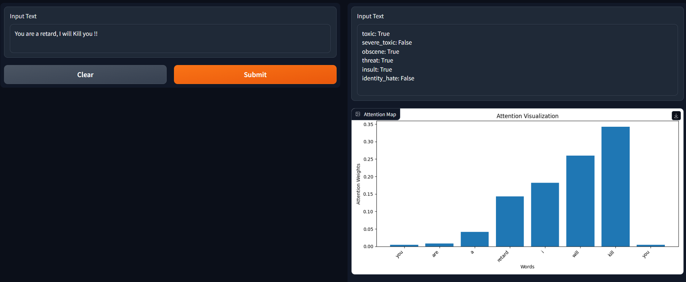

# Toxicity Detection with Attention

This repository contains code for a toxicity detection model using attention in TensorFlow. The model analyzes comments and predicts the toxicity level, and provides an attention visualization to highlight important words.

## Demo


## Dataset

The model is trained on the "Jigsaw Toxic Comment Classification Challenge" dataset. The dataset contains comments labeled with toxicity levels across multiple categories. It can be found [here](https://www.kaggle.com/datasets/julian3833/jigsaw-toxic-comment-classification-challenge)

## Prerequisites

Before running the code, ensure you have the following dependencies installed:

- Python (version 3.7 or higher)
- TensorFlow (version 2.x)
- Pandas
- Gradio

## Installation

1. Clone the repository:

   ```shell
   git clone https://github.com/AbtgCoder/Toxicity-Detection-with-Attention.git
   cd toxicity-detection-with-attention
   ```

2. Include the Prebuilt Model:
   -  Place the prebuilt Attention based toxicity model file (`att_toxicity_model.h5`) in the root folder of the repository.
     
3. Build and Train Model:
 - Run the `main.py` script to preprocess the data, train the model, and evaluate its performance on test data.
   ```shell
   python main.py
   ```

4. Visualize Attention weights using Gradio:
 - Run the `make_gradio_app.py` script to launch a local gradio demo with the trained model, it will showcase the attention weights for the input comment.
   ```shell
   python make_gradio_app.py
   ```

## File Descriptions

- `main.py`: Entry point of the program, used to build, train and evaluate the entire model.
- `data_processing.py`: Script to preprocess and prepare datasets for training and testing of the model.
- `model_training.py`: Script to train an attention-based toxicity detection model.
- `model_evaluation.py`: Script to evaluate efficay of the model on test dataset.
- `make_gradio_app.py`: Script to launch a gradio demo and visualize important parts of input comment.
- `att_toxicity_model.h5`: Pre-trained model file for attention based toxicity detection in input comments.

## License

This project is licensed under the [MIT License](LICENSE.txt).

## Contact

For any questions or inquiries, you can reach me at:
- Email:  [abtgofficial@gmail.com](mailto:abtgofficial@gmail.com)